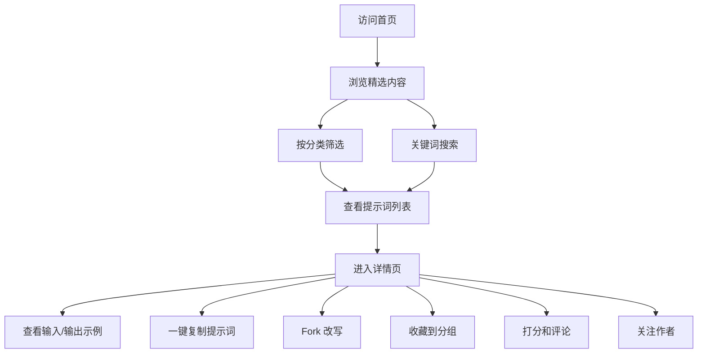
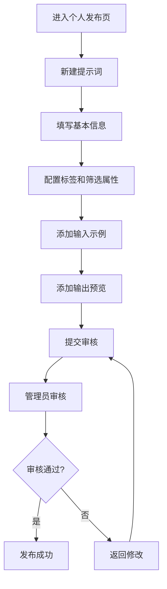
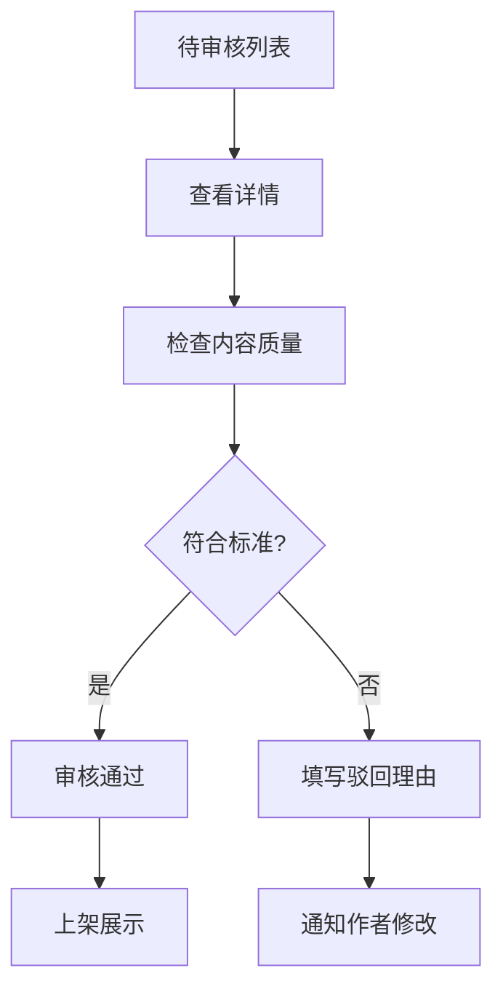

## 1. 产品概述
面向运营、设计、产品等团队的 Prompt 共享平台，解决高质量提示词复用难、跨团队协作效率低的问题。通过结构化的提示词管理、多维度筛选和社区互动，打造专业的 AI 提示词知识库。

- 核心价值：建立团队级提示词资产库，提升 AI 工具使用效率，沉淀最佳实践
- 目标用户：运营人员、设计师、产品经理、AI 开发者及所有需要复用提示词的团队成员

## 2. 核心功能

### 2.1 用户角色

| 角色 | 注册方式 | 核心权限 |
|------|----------|----------|
| 普通用户 | 邮箱注册 | 浏览、搜索、筛选、复制、收藏、评论、打分、关注作者、发布提示词、提交举报 |
| 认证作者 | 申请审核 | 发布提示词、提交版本更新、查看数据统计、管理个人作品集 |
| 管理员 | 后台分配 | 审核上架、维护标签、处理举报、配置首页推荐、管理用户权限 |

### 2.2 功能模块

1. **首页精选**：Hero 区域、精选推荐、热门分类、最新发布、排行榜
2. **分类浏览**：按用途、模型、语言、难度多维度筛选
3. **搜索筛选**：关键词搜索、高级筛选、排序切换
4. **提示词详情**：输入示例、输出预览、适用场景、版本历史、相关推荐
5. **收藏夹**：我的收藏、自定义分组、批量操作
6. **个人发布页**：作品管理、数据统计、版本管理、个人资料
7. **管理后台**：内容审核、标签管理、举报处理、首页配置、用户管理

### 2.3 页面详情

| 页面名称 | 模块名称 | 功能描述 |
|----------|----------|----------|
| 首页 | Hero 区域 | 平台 Slogan、搜索框、热门标签快捷入口 |
| 首页 | 精选推荐 | 编辑推荐的高质量提示词卡片 |
| 首页 | 分类导航 | 按用途分类的快捷入口 |
| 首页 | 热门榜单 | 按收藏数、使用数排序的排行榜 |
| 分类浏览页 | 筛选面板 | 用途、模型、语言、难度多维度筛选 |
| 分类浏览页 | 结果列表 | 卡片式提示词展示、排序切换 |
| 搜索结果页 | 搜索栏 | 关键词输入、搜索建议、历史记录 |
| 搜索结果页 | 结果展示 | 匹配度高亮、筛选器、空状态引导 |
| 详情页 | 内容区 | 标题、作者、评分、标签、完整提示词 |
| 详情页 | 示例区 | 输入示例、输出预览、适用场景 |
| 详情页 | 操作区 | 一键复制、Fork 改写、收藏、打分、评论 |
| 详情页 | 互动区 | 评论列表、回复、点赞 |
| 收藏夹页 | 分组管理 | 自定义分组、重命名、删除、移动 |
| 收藏夹页 | 收藏列表 | 卡片展示、快速操作、搜索过滤 |
| 个人发布页 | 作品管理 | 已发布、审核中、已下架列表 |
| 个人发布页 | 数据统计 | 浏览量、收藏数、使用数趋势图 |
| 个人发布页 | 版本管理 | 版本历史、对比、回滚 |
| 管理后台 | 内容审核 | 待审核列表、通过/驳回、批量操作 |
| 管理后台 | 标签管理 | 标签增删改、分类管理、合并标签 |
| 管理后台 | 举报处理 | 举报列表、处理记录、内容下架 |
| 管理后台 | 首页配置 | 推荐位配置、Banner 管理、排序规则 |

## 3. 核心流程

### 3.1 用户浏览与使用流程

### 3.2 作者发布流程

### 3.3 管理员审核流程

## 4. 用户界面设计

### 4.1 设计风格

- **主色调**：深海墨蓝 `#0F172A` - 专业、稳重、科技感
- **强调色**：暖琥珀 `#F59E0B` - 温暖、醒目、引导操作
- **背景色**：米白暖调 `#FAF7F2` - 舒适、阅读友好
- **辅助色**：苔藓绿 `#059669` 用于成功状态，朱砂红 `#DC2626` 用于警告
- **按钮风格**：矩形微圆角 (6px)、实心主按钮、边框次按钮、悬浮时轻微上浮 + 阴影
- **字体**：
  - 标题：Fraunces (衬线，编辑气质)
  - 正文：Archivo (无衬线，清晰易读)
  - 代码/提示词：JetBrains Mono (等宽，专业感)
- **布局风格**：不对称网格、重叠元素、留白充足、卡片边缘微粗边框
- **图标风格**：线性图标 (lucide-react)、1.5px 线宽、统一圆角
- **特殊效果**：印刷网点纹理背景、轻微噪点叠加、标题字重对比强烈

### 4.2 页面设计概览

| 页面名称 | 模块名称 | UI 元素 |
|----------|----------|----------|
| 首页 | Hero 区域 | 超大衬线标题分层排列、琥珀色渐变下划线、搜索框带模糊背景、标签云浮动排列 |
| 首页 | 精选卡片 | 悬停时 3° 微旋转、提示词预览截断显示、收藏数热标、作者头像徽章 |
| 首页 | 分类导航 | 图标 + 文字双行布局、选中状态琥珀色背景、悬停上浮 |
| 详情页 | 内容区 | 三栏布局：左侧目录、中间内容、右侧操作栏 |
| 详情页 | 提示词区 | 代码块样式、行号显示、一键复制按钮、语法高亮 |
| 详情页 | 示例区 | 左右对比布局、输入输出标签区分、可折叠展开 |
| 管理后台 | 数据看板 | 卡片式统计、趋势图、待办事项列表 |

### 4.3 响应式设计

- **桌面端** (≥1280px)：三栏布局、侧边筛选面板固定
- **平板端** (768px-1279px)：两栏布局、筛选面板可折叠
- **移动端** (<768px)：单列布局、底部导航栏、筛选弹窗
- **触控优化**：按钮最小 44x44px、滑动手势支持、下拉刷新

### 4.4 动效设计

- **页面加载**：内容自上而下 staggered 淡入、首屏图片 progressive 加载
- **卡片悬停**：translateY(-4px) + 阴影加深 + 边框高亮
- **复制反馈**：按钮文字从"复制"变为"已复制" + 对勾动画
- **收藏动画**：心形图标填充 + 轻微弹跳
- **评论提交**：新评论从底部滑入 + 高亮闪烁
- **模态框**：背景模糊 + 缩放进入 + 轻微弹性
