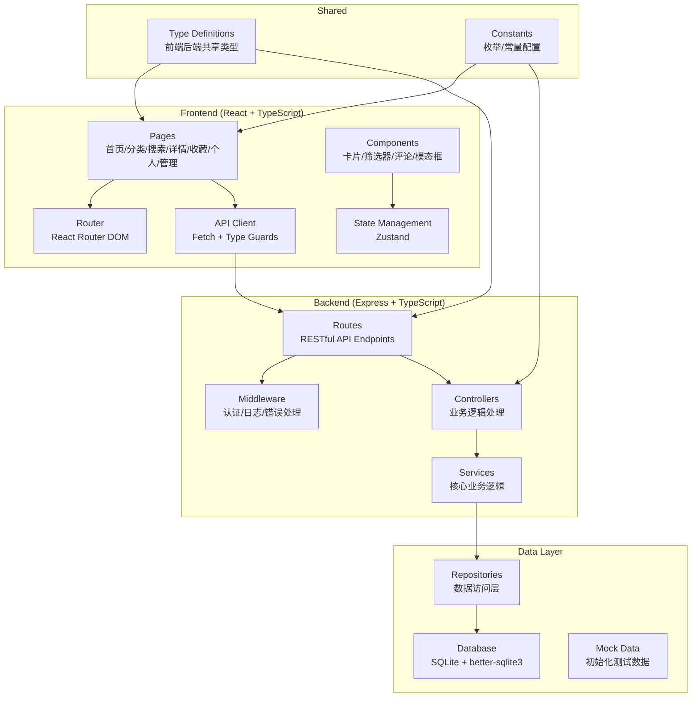
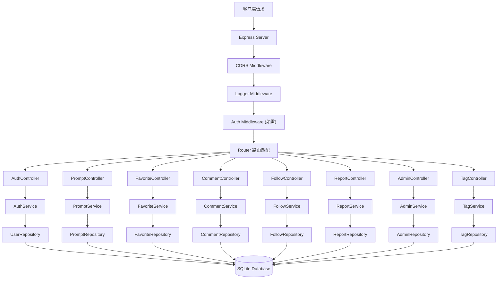
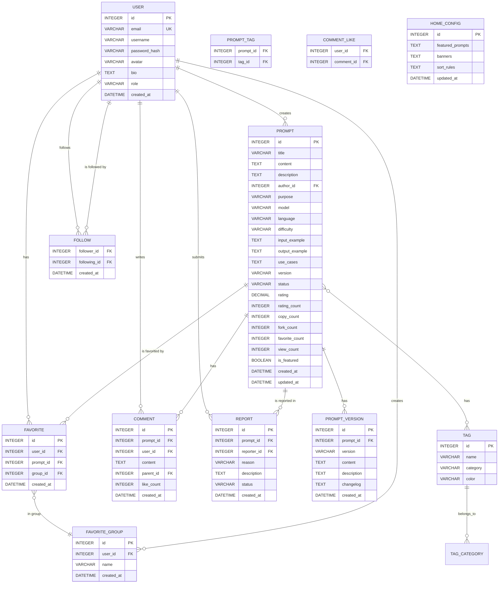

## 1. 架构设计



## 2. 技术选型

### 前端技术栈
- **框架**: React 18 + TypeScript
- **构建工具**: Vite 5
- **路由**: React Router DOM 6
- **状态管理**: Zustand 4
- **样式**: Tailwind CSS 3
- **图标**: Lucide React
- **HTTP 客户端**: Fetch API (原生)
- **代码高亮**: prismjs (用于提示词展示)

### 后端技术栈
- **框架**: Express 4 + TypeScript
- **数据库**: SQLite + better-sqlite3
- **认证**: JWT (jsonwebtoken)
- **密码加密**: bcryptjs
- **请求验证**: zod
- **CORS**: cors
- **日志**: morgan

### 开发工具
- **包管理器**: pnpm
- **代码检查**: ESLint + TypeScript
- **格式化**: Prettier
- **类型检查**: tsc --noEmit

## 3. 路由定义

### 前端路由
| 路径 | 页面 | 说明 |
|------|------|------|
| `/` | 首页 | 精选推荐、热门分类、最新发布 |
| `/category` | 分类浏览 | 多维度筛选、列表展示 |
| `/search` | 搜索结果 | 关键词搜索、高级筛选 |
| `/prompt/:id` | 提示词详情 | 完整内容、示例、互动 |
| `/favorites` | 收藏夹 | 我的收藏、分组管理 |
| `/profile` | 个人中心 | 个人资料、关注列表 |
| `/my-prompts` | 个人发布 | 作品管理、数据统计 |
| `/create` | 发布提示词 | 新建/编辑提示词表单 |
| `/admin` | 管理后台 | 内容审核、标签管理 |
| `/login` | 登录 | 用户登录 |
| `/register` | 注册 | 用户注册 |

### 后端 API 路由
| 方法 | 路径 | 模块 | 说明 |
|------|------|------|------|
| POST | `/api/auth/register` | Auth | 用户注册 |
| POST | `/api/auth/login` | Auth | 用户登录 |
| GET | `/api/auth/profile` | Auth | 获取当前用户信息 |
| GET | `/api/prompts` | Prompts | 获取提示词列表（支持筛选） |
| GET | `/api/prompts/:id` | Prompts | 获取提示词详情 |
| POST | `/api/prompts` | Prompts | 创建提示词（提交审核） |
| PUT | `/api/prompts/:id` | Prompts | 更新提示词 |
| DELETE | `/api/prompts/:id` | Prompts | 删除提示词 |
| POST | `/api/prompts/:id/copy` | Prompts | 记录复制次数 |
| POST | `/api/prompts/:id/fork` | Prompts | Fork 提示词 |
| POST | `/api/prompts/:id/rate` | Prompts | 打分 |
| GET | `/api/prompts/:id/versions` | Prompts | 获取版本历史 |
| POST | `/api/favorites` | Favorites | 添加收藏 |
| DELETE | `/api/favorites/:id` | Favorites | 取消收藏 |
| GET | `/api/favorites` | Favorites | 获取收藏列表 |
| POST | `/api/favorites/groups` | Favorites | 创建收藏分组 |
| GET | `/api/comments/:promptId` | Comments | 获取评论列表 |
| POST | `/api/comments` | Comments | 发表评论 |
| POST | `/api/comments/:id/like` | Comments | 点赞评论 |
| POST | `/api/follow` | Follow | 关注用户 |
| DELETE | `/api/follow/:userId` | Follow | 取消关注 |
| GET | `/api/follow/following` | Follow | 获取关注列表 |
| GET | `/api/follow/followers` | Follow | 获取粉丝列表 |
| POST | `/api/reports` | Reports | 提交举报 |
| GET | `/api/admin/prompts/pending` | Admin | 获取待审核列表 |
| PUT | `/api/admin/prompts/:id/approve` | Admin | 审核通过 |
| PUT | `/api/admin/prompts/:id/reject` | Admin | 审核驳回 |
| GET | `/api/admin/reports` | Admin | 获取举报列表 |
| PUT | `/api/admin/reports/:id` | Admin | 处理举报 |
| GET | `/api/tags` | Tags | 获取标签列表 |
| POST | `/api/admin/tags` | Admin | 创建标签 |
| PUT | `/api/admin/tags/:id` | Admin | 更新标签 |
| DELETE | `/api/admin/tags/:id` | Admin | 删除标签 |
| GET | `/api/admin/home-config` | Admin | 获取首页配置 |
| PUT | `/api/admin/home-config` | Admin | 更新首页配置 |

## 4. API 类型定义

```typescript
// shared/types/index.ts

export interface User {
  id: number;
  email: string;
  username: string;
  avatar: string;
  bio: string;
  role: 'user' | 'author' | 'admin';
  createdAt: string;
  followerCount: number;
  followingCount: number;
}

export interface Tag {
  id: number;
  name: string;
  category: 'purpose' | 'model' | 'language' | 'difficulty';
  color: string;
  promptCount: number;
}

export interface Prompt {
  id: number;
  title: string;
  content: string;
  description: string;
  authorId: number;
  author: User;
  tags: Tag[];
  purpose: string;
  model: string;
  language: string;
  difficulty: 'beginner' | 'intermediate' | 'advanced';
  inputExample: string;
  outputExample: string;
  useCases: string[];
  version: string;
  versionHistory: PromptVersion[];
  status: 'pending' | 'approved' | 'rejected' | 'removed';
  rating: number;
  ratingCount: number;
  copyCount: number;
  forkCount: number;
  favoriteCount: number;
  viewCount: number;
  isFeatured: boolean;
  createdAt: string;
  updatedAt: string;
}

export interface PromptVersion {
  id: number;
  promptId: number;
  version: string;
  content: string;
  description: string;
  changelog: string;
  createdAt: string;
}

export interface Comment {
  id: number;
  promptId: number;
  userId: number;
  user: User;
  content: string;
  parentId: number | null;
  likeCount: number;
  isLiked: boolean;
  createdAt: string;
}

export interface Favorite {
  id: number;
  userId: number;
  promptId: number;
  prompt: Prompt;
  groupId: number | null;
  createdAt: string;
}

export interface FavoriteGroup {
  id: number;
  userId: number;
  name: string;
  promptCount: number;
}

export interface Report {
  id: number;
  promptId: number;
  reporterId: number;
  reason: string;
  description: string;
  status: 'pending' | 'resolved' | 'rejected';
  createdAt: string;
}

// Request types
export interface RegisterRequest {
  email: string;
  username: string;
  password: string;
}

export interface LoginRequest {
  email: string;
  password: string;
}

export interface CreatePromptRequest {
  title: string;
  content: string;
  description: string;
  tagIds: number[];
  purpose: string;
  model: string;
  language: string;
  difficulty: 'beginner' | 'intermediate' | 'advanced';
  inputExample: string;
  outputExample: string;
  useCases: string[];
  changelog: string;
}

export interface RatePromptRequest {
  rating: number; // 1-5
}

export interface CreateCommentRequest {
  promptId: number;
  content: string;
  parentId?: number;
}

export interface CreateReportRequest {
  promptId: number;
  reason: string;
  description: string;
}

// Response types
export interface ApiResponse<T> {
  success: boolean;
  data?: T;
  message?: string;
  error?: string;
}

export interface PaginatedResponse<T> {
  items: T[];
  total: number;
  page: number;
  pageSize: number;
  totalPages: number;
}

export interface AuthResponse {
  token: string;
  user: User;
}
```

## 5. 服务端架构图



## 6. 数据模型

### 6.1 ER 图



### 6.2 DDL 语句

```sql
-- 用户表
CREATE TABLE users (
    id INTEGER PRIMARY KEY AUTOINCREMENT,
    email VARCHAR(255) UNIQUE NOT NULL,
    username VARCHAR(50) NOT NULL,
    password_hash VARCHAR(255) NOT NULL,
    avatar VARCHAR(500),
    bio TEXT,
    role VARCHAR(20) DEFAULT 'user',
    created_at DATETIME DEFAULT CURRENT_TIMESTAMP
);

-- 提示词表
CREATE TABLE prompts (
    id INTEGER PRIMARY KEY AUTOINCREMENT,
    title VARCHAR(200) NOT NULL,
    content TEXT NOT NULL,
    description TEXT,
    author_id INTEGER NOT NULL,
    purpose VARCHAR(100),
    model VARCHAR(100),
    language VARCHAR(50),
    difficulty VARCHAR(20),
    input_example TEXT,
    output_example TEXT,
    use_cases TEXT,
    version VARCHAR(20) DEFAULT '1.0.0',
    status VARCHAR(20) DEFAULT 'pending',
    rating DECIMAL(3,2) DEFAULT 0,
    rating_count INTEGER DEFAULT 0,
    copy_count INTEGER DEFAULT 0,
    fork_count INTEGER DEFAULT 0,
    favorite_count INTEGER DEFAULT 0,
    view_count INTEGER DEFAULT 0,
    is_featured BOOLEAN DEFAULT 0,
    created_at DATETIME DEFAULT CURRENT_TIMESTAMP,
    updated_at DATETIME DEFAULT CURRENT_TIMESTAMP,
    FOREIGN KEY (author_id) REFERENCES users(id)
);

-- 版本历史表
CREATE TABLE prompt_versions (
    id INTEGER PRIMARY KEY AUTOINCREMENT,
    prompt_id INTEGER NOT NULL,
    version VARCHAR(20) NOT NULL,
    content TEXT NOT NULL,
    description TEXT,
    changelog TEXT,
    created_at DATETIME DEFAULT CURRENT_TIMESTAMP,
    FOREIGN KEY (prompt_id) REFERENCES prompts(id)
);

-- 标签表
CREATE TABLE tags (
    id INTEGER PRIMARY KEY AUTOINCREMENT,
    name VARCHAR(50) UNIQUE NOT NULL,
    category VARCHAR(50) NOT NULL,
    color VARCHAR(20) DEFAULT '#F59E0B'
);

-- 提示词标签关联表
CREATE TABLE prompt_tags (
    prompt_id INTEGER NOT NULL,
    tag_id INTEGER NOT NULL,
    PRIMARY KEY (prompt_id, tag_id),
    FOREIGN KEY (prompt_id) REFERENCES prompts(id),
    FOREIGN KEY (tag_id) REFERENCES tags(id)
);

-- 收藏表
CREATE TABLE favorites (
    id INTEGER PRIMARY KEY AUTOINCREMENT,
    user_id INTEGER NOT NULL,
    prompt_id INTEGER NOT NULL,
    group_id INTEGER,
    created_at DATETIME DEFAULT CURRENT_TIMESTAMP,
    FOREIGN KEY (user_id) REFERENCES users(id),
    FOREIGN KEY (prompt_id) REFERENCES prompts(id),
    FOREIGN KEY (group_id) REFERENCES favorite_groups(id)
);

-- 收藏分组表
CREATE TABLE favorite_groups (
    id INTEGER PRIMARY KEY AUTOINCREMENT,
    user_id INTEGER NOT NULL,
    name VARCHAR(50) NOT NULL,
    created_at DATETIME DEFAULT CURRENT_TIMESTAMP,
    FOREIGN KEY (user_id) REFERENCES users(id)
);

-- 评论表
CREATE TABLE comments (
    id INTEGER PRIMARY KEY AUTOINCREMENT,
    prompt_id INTEGER NOT NULL,
    user_id INTEGER NOT NULL,
    content TEXT NOT NULL,
    parent_id INTEGER,
    like_count INTEGER DEFAULT 0,
    created_at DATETIME DEFAULT CURRENT_TIMESTAMP,
    FOREIGN KEY (prompt_id) REFERENCES prompts(id),
    FOREIGN KEY (user_id) REFERENCES users(id),
    FOREIGN KEY (parent_id) REFERENCES comments(id)
);

-- 评论点赞表
CREATE TABLE comment_likes (
    user_id INTEGER NOT NULL,
    comment_id INTEGER NOT NULL,
    PRIMARY KEY (user_id, comment_id),
    FOREIGN KEY (user_id) REFERENCES users(id),
    FOREIGN KEY (comment_id) REFERENCES comments(id)
);

-- 关注表
CREATE TABLE follows (
    follower_id INTEGER NOT NULL,
    following_id INTEGER NOT NULL,
    created_at DATETIME DEFAULT CURRENT_TIMESTAMP,
    PRIMARY KEY (follower_id, following_id),
    FOREIGN KEY (follower_id) REFERENCES users(id),
    FOREIGN KEY (following_id) REFERENCES users(id)
);

-- 举报表
CREATE TABLE reports (
    id INTEGER PRIMARY KEY AUTOINCREMENT,
    prompt_id INTEGER NOT NULL,
    reporter_id INTEGER NOT NULL,
    reason VARCHAR(100) NOT NULL,
    description TEXT,
    status VARCHAR(20) DEFAULT 'pending',
    created_at DATETIME DEFAULT CURRENT_TIMESTAMP,
    FOREIGN KEY (prompt_id) REFERENCES prompts(id),
    FOREIGN KEY (reporter_id) REFERENCES users(id)
);

-- 首页配置表
CREATE TABLE home_config (
    id INTEGER PRIMARY KEY AUTOINCREMENT,
    featured_prompts TEXT,
    banners TEXT,
    sort_rules TEXT,
    updated_at DATETIME DEFAULT CURRENT_TIMESTAMP
);

-- 索引
CREATE INDEX idx_prompts_author ON prompts(author_id);
CREATE INDEX idx_prompts_status ON prompts(status);
CREATE INDEX idx_prompts_purpose ON prompts(purpose);
CREATE INDEX idx_prompts_model ON prompts(model);
CREATE INDEX idx_prompts_language ON prompts(language);
CREATE INDEX idx_prompts_difficulty ON prompts(difficulty);
CREATE INDEX idx_prompts_featured ON prompts(is_featured);
CREATE INDEX idx_prompts_created ON prompts(created_at DESC);
CREATE INDEX idx_comments_prompt ON comments(prompt_id);
CREATE INDEX idx_favorites_user ON favorites(user_id);
CREATE INDEX idx_follows_follower ON follows(follower_id);
CREATE INDEX idx_follows_following ON follows(following_id);
```

### 6.3 初始化数据

```sql
-- 插入初始标签
INSERT INTO tags (name, category, color) VALUES
('内容创作', 'purpose', '#F59E0B'),
('代码开发', 'purpose', '#3B82F6'),
('设计创意', 'purpose', '#EC4899'),
('数据分析', 'purpose', '#10B981'),
('营销文案', 'purpose', '#8B5CF6'),
('教育学习', 'purpose', '#06B6D4'),

('GPT-4', 'model', '#F59E0B'),
('GPT-3.5', 'model', '#F97316'),
('Claude 3', 'model', '#8B5CF6'),
('Gemini', 'model', '#3B82F6'),
('Midjourney', 'model', '#10B981'),
('DALL-E', 'model', '#EC4899'),

('中文', 'language', '#F59E0B'),
('英文', 'language', '#3B82F6'),
('双语', 'language', '#10B981'),

('入门', 'difficulty', '#10B981'),
('进阶', 'difficulty', '#F59E0B'),
('高级', 'difficulty', '#EF4444');

-- 插入测试用户
INSERT INTO users (email, username, password_hash, avatar, bio, role) VALUES
('admin@promptshare.com', '管理员', '$2a$10$...', '/avatars/admin.png', '平台管理员，负责内容审核和社区管理', 'admin'),
('author1@promptshare.com', '创意大师', '$2a$10$...', '/avatars/author1.png', '专注于内容创作和设计类提示词', 'author'),
('user1@promptshare.com', '普通用户', '$2a$10$...', '/avatars/user1.png', '热爱 AI 工具的产品经理', 'user');

-- 插入首页配置
INSERT INTO home_config (featured_prompts, banners, sort_rules) VALUES
('[1,2,3,4,5,6]', '[]', '{"defaultSort":"createdAt","featuredWeight":2}');
```
